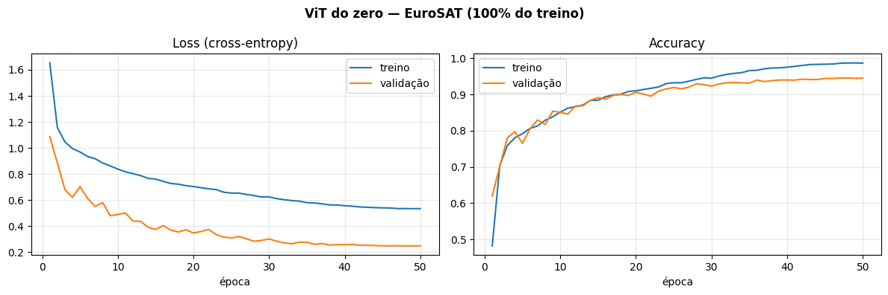
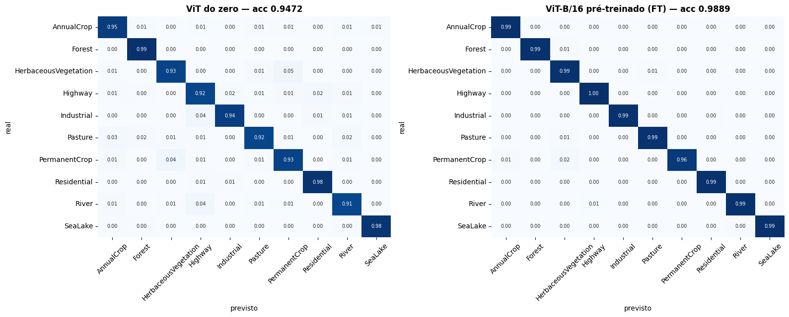
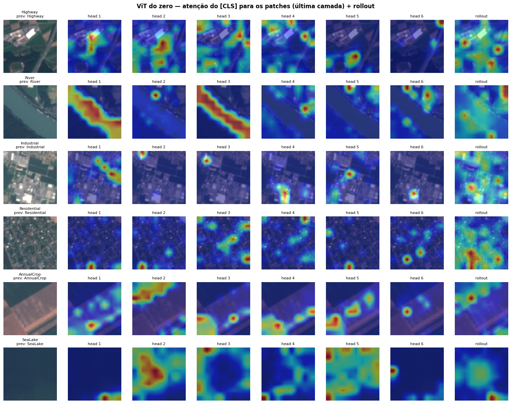
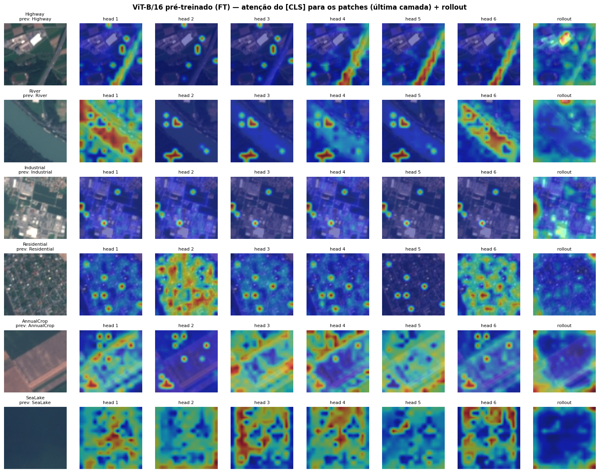
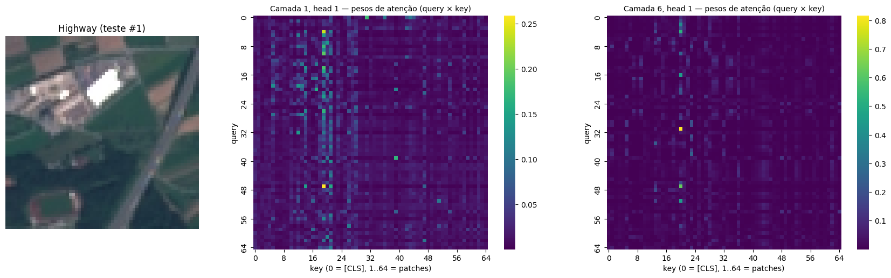
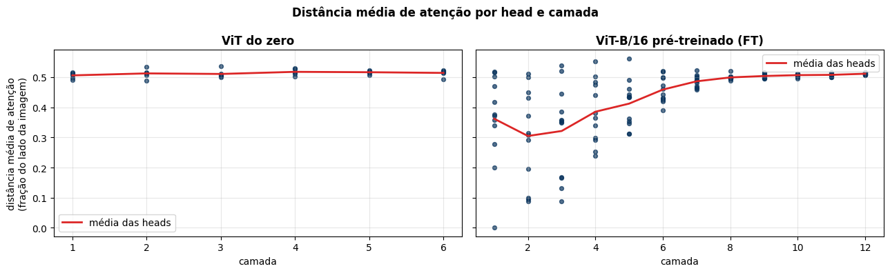
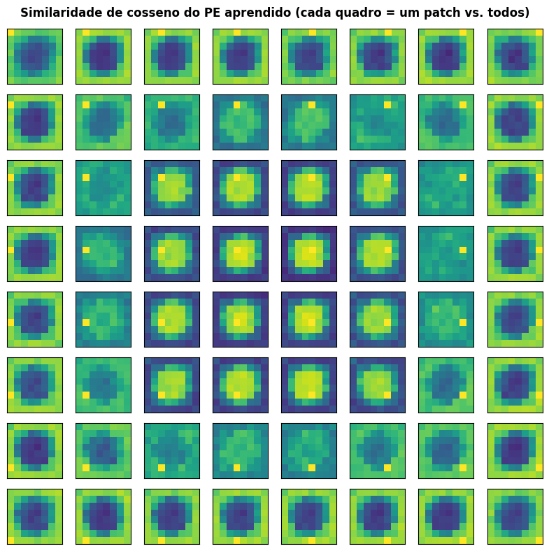

# A1 — Vision Transformers: da attention ao fine-tuning

> Um **Vision Transformer construído do zero** — scaled dot-product attention → multi-head attention →
> `TransformerEncoderBlock` → ViT — treinado em imagens de satélite **Sentinel-2 (EuroSAT)** e comparado com um
> **ViT-B/16 pré-treinado no ImageNet-21k** com fine-tuning. Com attention maps interpretados e justificativa técnica
> de cada decisão.

<p>


</p>

Projeto da disciplina **Deep Learning & Computer Vision**. Entregável autossuficiente: um único notebook que roda do
início ao fim no **Google Colab (GPU T4)** sem edições — sem Google Drive e sem credenciais.

---

## Destaques

- **Tudo do zero e testado.** Scaled dot-product attention, multi-head attention com **projeções independentes por
  head** (`AttentionHead` separado para cada uma) e concatenação, FFN de 2 camadas, LayerNorm Pre-LN e residual —
  cada módulo com testes `assert`, incluindo **equivalência numérica** com `F.scaled_dot_product_attention` e
  `nn.MultiheadAttention` do PyTorch.
- **Positional encoding demonstrado, não só explicado.** Prova de que attention sem PE é invariante a permutação
  (logits idênticos com os 64 patches embaralhados), **ablação** de um ViT treinado sem PE e visualização da grade 2D
  que o PE aprendido reconstrói a partir de uma tabela 1D.
- **Comparação controlada.** ViT do zero (2,7 M parâmetros) × ViT-B/16 pré-treinado (86 M) no **mesmo loop**, mesmos
  dados, mesma augmentation e mesmas métricas — em **100% e em 10%** do treino, para justificar a arquitetura com base
  na quantidade de dados.
- **Attention maps em três níveis**: heatmap da matriz 65×65 de uma head, atenção do `[CLS]` head a head sobre a
  imagem, e **attention rollout** — mais a **distância média de atenção** por camada (local × global).
- **Análises escritas** ancoradas nos resultados: BERT × ViT no pré-treino, DeiT e Swin, ViT × CNN no domínio.
- **Baseado nas aulas**: módulos da Aula 02, loop e checkpoint das Aulas 02/03, `AutoModelForImageClassification` +
  rollout da Aula 04, EuroSAT + checkpoint in21k + DeiT + DINO da Aula 05.

## O que o projeto faz

| Etapa | Entrada | Saída |
|---|---|---|
| **Attention do zero** (§2) | tensores sintéticos | módulos `ScaledDotProductAttention`, `MultiHeadAttention`, `TransformerEncoderBlock` + testes |
| **ViT do zero** (§3) | imagem 3×64×64 | `PatchEmbedding` + `[CLS]` + PE aprendível → 6 blocos → logits; prova da invariância a permutação |
| **Treino do zero** (§4) | 16.200 imagens EuroSAT | curvas de loss/accuracy; ablação sem PE |
| **Fine-tuning** (§5) | mesmo treino, 224 px | ViT-B/16 in21k com novo `classifier` `Linear(768, 10)` |
| **Comparação** (§6) | teste (5.400 imagens) | tabela quantitativa, F1 por classe, matrizes de confusão, regime de 10% dos dados |
| **Attention maps** (§7) | imagens de teste | heatmaps por head, rollout, distância de atenção, similaridade do PE |
| **Teoria** (§8) | — | BERT × ViT, DeiT e Swin, ViT × CNN, hiperparâmetros e próximos passos |

Pipeline: **EuroSAT → tensores `uint8` em memória → augmentation D4 na GPU → ViT do zero / ViT-B/16 fine-tuning
(AdamW + warmup + cosseno + AMP) → melhor checkpoint pela validação → teste → attention maps**.

## Dataset

**EuroSAT RGB** (Helber et al., 2019) — Hugging Face [`timm/eurosat-rgb`](https://huggingface.co/datasets/timm/eurosat-rgb),
o mesmo usado na Aula 05. 27.000 *tiles* 64×64 do satélite **Sentinel-2** (ESA) em 34 países europeus.

| Split | Imagens | Uso |
|---|---|---|
| `train` | 16.200 | treino (e subconjunto estratificado de 10% = 1.620 para o experimento de poucos dados) |
| `validation` | 5.400 | escolha do melhor checkpoint |
| `test` | 5.400 | avaliação final, usada uma única vez |

Os splits oficiais são **estratificados** (mesma proporção de cada classe nos três — verificado no notebook §1) e o
desbalanceamento é leve (2.000–3.000 imagens por classe).

> **Classes (10):** AnnualCrop · Forest · HerbaceousVegetation · Highway · Industrial · Pasture · PermanentCrop ·
> Residential · River · SeaLake.

O download é automático via `datasets.load_dataset` — sem credenciais.

## Por que este domínio e esta arquitetura

**Domínio.** Classificação de uso e cobertura do solo é o bloco básico de mapas ambientais, monitoramento de
desmatamento, expansão urbana e inventário agrícola — e o Sentinel-2 revisita cada ponto da Terra a cada ~5 dias,
volume impossível de rotular à mão. É também um domínio **distante do ImageNet** (vista de topo, sem orientação
canônica, classes definidas por textura e cor espectral), o que torna a pergunta "o pré-treino transfere?" interessante.

**Por que o EuroSAT viabiliza o ViT do zero.** Com imagens 64×64 e patch 8, cada imagem vira só 64 tokens — o ViT do
zero treina 50 épocas em minutos na T4. Em 224×224 um ViT do zero exigiria ordens de grandeza mais dados e tempo, e a
comparação do zero × pré-treinado que a atividade pede não caberia no Colab.

**Arquiteturas.**

| | ViT do zero | ViT-B/16 pré-treinado |
|---|---|---|
| Checkpoint | — | `google/vit-base-patch16-224-in21k` (Aula 05) |
| Entrada | 64×64, patch 8 → 64 tokens + `[CLS]` | 224×224 (upsampling), patch 16 → 196 tokens + `[CLS]` |
| $d_{model}$ / heads / blocos | 192 / 6 / 6 | 768 / 12 / 12 |
| Parâmetros | ~2,7 M | ~86 M |
| Otimização | AdamW LR 1e-3, wd 0,05, 5 ép. warmup + cosseno, 50 épocas, batch 128 | AdamW LR 5e-5, wd 0,01, warmup + cosseno, 3 épocas, batch 32 |
| Regularização | dropout 0,1, label smoothing 0,1, D4, clipping 1,0 | D4, clipping 1,0 |

**Augmentation D4** (flips horizontal/vertical + rotações de 90°): imagens de satélite não têm "para cima", então as 8
simetrias do quadrado preservam o rótulo. **Sem color jitter**: a cor espectral é evidência de classe (água ×
vegetação × solo exposto).

Justificativa completa de cada hiperparâmetro nas tabelas das §4 e §5 do notebook.

## Arquitetura do ViT do zero

```
imagem 3×64×64
  └─ PatchEmbedding  Conv2d(3, 192, k=8, s=8) ≡ patches 8×8 achatados + Linear   → 64 × 192
  └─ concat [CLS] aprendível                                                    → 65 × 192
  └─ + positional embedding aprendível [1, 65, 192]                             → 65 × 192
  └─ 6 × TransformerEncoderBlock (Pre-LN)
  │     x = x + MultiHeadAttention(LN(x))      6 × AttentionHead(W_Q, W_K, W_V próprios, d_k = 32) → concat → W_O
  │     x = x + FFN(LN(x))                     Linear(192, 768) → GELU → Linear(768, 192)
  └─ LayerNorm → token [CLS] → Linear(192, 10) → logits
```

## Estrutura

```
A1_vision_transformers/
├── A1_vision_transformers.ipynb   # ENTREGÁVEL — roda sozinho no Colab T4
├── figures/                       # figuras geradas pelo notebook
├── results/                       # métricas (tabela comparativa, F1 por classe, metrics.json)
├── checkpoints/                   # melhores pesos de cada treino (gitignored)
├── requirements.txt
├── README.md
└── LICENSE
```

## Setup

```bash
python -m venv venv
source venv/Scripts/activate      # Windows Git Bash;  Linux/Mac: source venv/bin/activate
pip install -r requirements.txt
```

## Rodar

**Colab (recomendado, GPU T4).** Abrir `A1_vision_transformers.ipynb`, selecionar runtime **T4**
(Runtime → Change runtime type → T4 GPU) e executar todas as células (Runtime → Run all). Dataset e pesos são baixados
do Hugging Face Hub automaticamente. Tempo estimado: ~30–40 min. Ao final, baixar o notebook executado e as pastas
`figures/` e `results/`.

**Local.** Sem GPU o treino completo é lento (o fine-tuning do ViT-B/16 em CPU leva horas). Para validar o notebook de
ponta a ponta em minutos, há um modo de teste com subconjuntos minúsculos:

```bash
A1_SMOKE=1 jupyter nbconvert --to notebook --execute A1_vision_transformers.ipynb --output smoke.ipynb
```

## Resultados

_Preencher após a execução na T4 (números impressos no §9 do notebook e salvos em `results/`)._

| Modelo | Pré-treino | Dados de treino | Parâmetros | Accuracy (teste) | F1 macro | Tempo de treino |
|---|---|---|---|---|---|---|
| ViT do zero | — | 100% | 2,7 M | — | — | — |
| ViT do zero sem PE | — | 100% | 2,7 M | — | — | — |
| ViT do zero | — | 10% | 2,7 M | — | — | — |
| ViT-B/16 (fine-tuning) | ImageNet-21k | 100% | 86 M | — | — | — |
| ViT-B/16 (fine-tuning) | ImageNet-21k | 10% | 86 M | — | — | — |

| Curvas do ViT do zero | Matrizes de confusão |
|---|---|
|  |  |

| Atenção do `[CLS]` por head + rollout (ViT do zero) | Atenção do `[CLS]` por head + rollout (ViT-B/16) |
|---|---|
|  |  |

| Heatmap de uma head | Distância média de atenção | PE aprendido |
|---|---|---|
|  |  |  |

## Status (checklist da rubrica)

- [x] Scaled dot-product attention e multi-head attention **do zero** como módulos PyTorch testáveis, com projeções
      independentes por head e concatenação (§2.1–2.2)
- [x] `TransformerEncoderBlock` completo: FFN de 2 camadas, LayerNorm e residual connections — base do ViT (§2.3)
- [x] Patch embedding + `[CLS]` aprendível + positional encoding → ViT completo imagem → logits (§3)
- [x] Explicação escrita (com prova e demonstração) de por que attention sem PE não preserva posição (§3.1)
- [ ] ViT treinado **do zero** no EuroSAT (§4) — código pronto, executar na T4
- [ ] Fine-tuning do ViT-B/16 **pré-treinado** com novo classification head (§5) — código pronto, executar na T4
- [ ] Tabela quantitativa do zero × pré-treinado + justificativa da arquitetura com base nos dados (§6, §9)
- [ ] Heatmap de attention weights de ao menos 1 head + interpretação escrita das regiões emergentes (§7)
- [x] Análise escrita: pré-treinamento BERT × ViT — o que cada um maximiza (§8.1)
- [x] Análise escrita: DeiT e Swin — o que cada um resolve que o ViT original não resolve (§8.2)
- [x] Análise escrita: quando ViT supera CNN e quando CNN é preferível, no EuroSAT (§8.3)
- [ ] Justificativa de hiperparâmetros + o que os resultados revelam + o que mudaria (§4, §5, §8.4 — completar com os números)
- [x] Requisitos de memória e tempo no topo do notebook (atualizar com os valores medidos na T4)

## Uso de IA

Houve uso de IA para auxílio no desenvolvimento do projeto.

## Referências

- Vaswani et al. (2017). *Attention Is All You Need*. arXiv:1706.03762.
- Dosovitskiy et al. (2021). *An Image is Worth 16x16 Words: Transformers for Image Recognition at Scale* (ViT). arXiv:2010.11929.
- Touvron et al. (2021). *Training data-efficient image transformers & distillation through attention* (DeiT). arXiv:2012.12877.
- Liu et al. (2021). *Swin Transformer: Hierarchical Vision Transformer using Shifted Windows*. arXiv:2103.14030.
- Caron et al. (2021). *Emerging Properties in Self-Supervised Vision Transformers* (DINO). arXiv:2104.14294.
- Devlin et al. (2019). *BERT: Pre-training of Deep Bidirectional Transformers for Language Understanding*. arXiv:1810.04805.
- Abnar & Zuidema (2020). *Quantifying Attention Flow in Transformers*. arXiv:2005.00928.
- Helber et al. (2019). *EuroSAT: A Novel Dataset and Deep Learning Benchmark for Land Use and Land Cover Classification*. IEEE JSTARS.

## Licença

MIT — ver [`LICENSE`](LICENSE).
